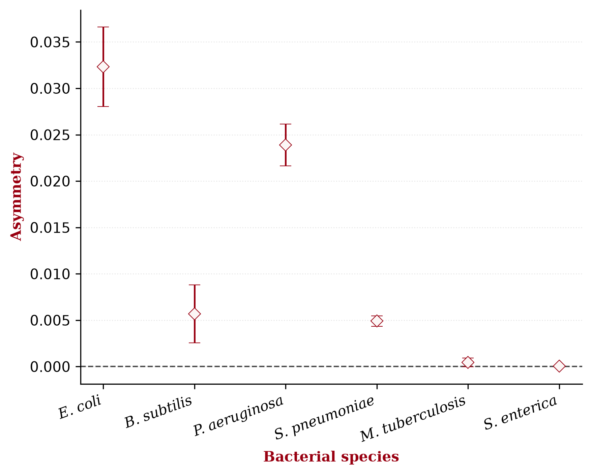

# Bacterial Population Analysis 
This project analyzed simulated data from a bacterial tracking experiment under specific nutrient and stress conditions.

## Table of Contents
- [Research Questions 🔎](#research-questions)
- [Dataset 🧫](#dataset)
- [Methods 💻](#methods)
- [Results 📊](#results)
- [Usage Instructions 📚](#usage-instructions)

## Research Questions 
The aim of this project was to quantify the abundance of wild-type and mutant bacterial strains. The following research questions were addressed: 
1. What are the average counts of each bacterial strain and their statistical uncertainties?
2. Is there an asymmetry in the abundance between the wild-type and mutant strains? If so, is the difference statistically significant?

## Dataset 
The dataset consists of 10 simulated bacterial tracking file (`output-Set1.txt` to `output-Set10.txt`), each containing 500,000 experiments. `output-Set0.txt` was excluded from the analysis. The dataset can be accessed [here](https://surfdrive.surf.nl/index.php/s/7udCnWTk4yMUASD). Each file consists of multiple experiments. Each experiment begins with a header containing the experiment code and the number of bacteria recorded in that experiment. Each row contains the three-dimensional momentum components (`px`, `py`, and `pz`) and the ID of the corresponding bacterial strain. Twelve bacterial IDs are included in the dataset, representing six bacterial species with a wild-type and mutant strain for each species.

<b>View bacterial strain IDs</b>

 

| ID | Bacterial species | Strain |
|---:|---|---|
| 211 | *E. coli* | Wild type |
| -211 | *E. coli* | Mutant |
| 321 | *B. subtilis* | Wild type |
| -321 | *B. subtilis* | Mutant |
| 2212 | *P. aeruginosa* | Wild type |
| -2212 | *P. aeruginosa* | Mutant |
| 3122 | *S. pneumoniae* | Wild type |
| -3122 | *S. pneumoniae* | Mutant |
| 3312 | *M. tuberculosis* | Wild type |
| -3312 | *M. tuberculosis* | Mutant |
| 3334 | *S. enterica* | Wild type |
| -3334 | *S. enterica* | Mutant |

## Methods 
### Average Bacterial Counts
For each of the 10 data files, the average bacterial count per experiment was calculated separately for each bacterial ID. Invalid experiments were excluded from the analysis. **An experiment was considered valid if it contained at least one of the 12 studied bacterial IDs.** For each bacterial ID, the total bacterial count within a batch (file) was divided by the number of valid experiments in that batch (file). This resulted in 10 independent batch averages for each bacterial ID.

### Final Average 
The final average count for each bacterial ID was calculated as the arithmetic mean of the 10 batch averages. A weighted average accounting for the different numbers of valid experiments in each batch was also calculated; however, no significant difference was found when compared to the arithmetic average. Consequently, the arithmetic mean was used for further analysis. Statistical uncertainties were estimated using subsampling. For each bacterial ID, the standard deviation of the 10 batch averages was calculated and used as the uncertainty of the final average.

### Difference between Wild-Type and Mutant
The asymmetry between the wild-type and corresponding mutant strain was quantified as the difference in their final average counts:

**Asymmetry = wild-type average − mutant average**

The uncertainty of the asymmetry was also estimated using subsampling. For each bacterial species, the wild-type and mutant batch averages were subtracted separately, producing 10 differences. The standard deviation of these 10 differences was used as the uncertainty of the final asymmetry per each bacterial ID pair. **An asymmetry was considered statistically significant when the interval defined by the WT−mutant difference ± its uncertainty did not include zero.**

## Results 
### Average Bacterial Counts 
The average bacterial counts per experiment and their statistical uncertainties are shown below. Uncertainties represent the standard deviation of the 10 batch averages obtained by subsampling.

| Bacterial species | Strain | Average count per event ± SD |
|---|---|---:|
| *E. coli* | Wild type | 19.964 ± 0.031 |
| *E. coli* | Mutant | 19.932 ± 0.030 |
| *B. subtilis* | Wild type | 2.5110 ± 0.0045 |
| *B. subtilis* | Mutant | 2.5053 ± 0.0052 |
| *P. aeruginosa* | Wild type | 1.2089 ± 0.0018 |
| *P. aeruginosa* | Mutant | 1.1850 ± 0.0023 |
| *S. pneumoniae* | Wild type | 0.2768 ± 0.0010 |
| *S. pneumoniae* | Mutant | 0.27189 ± 0.00093 |
| *M. tuberculosis* | Wild type | 0.03947 ± 0.00027 |
| *M. tuberculosis* | Mutant | 0.03903 ± 0.00038 |
| *S. enterica* | Wild type | 0.001188 ± 0.000040 |
| *S. enterica* | Mutant | 0.001152 ± 0.000048 |

### Wild-Type vs Mutant Asymmetry
The difference in abundance between the wild-type and mutant strain was calculated for each bacterial ID as wild-type − mutant. Uncertainties represent the standard deviation of the 10 subsample differences for each ID pair. 

*Figure 1. Difference in average bacterial count between wild-type and mutant strains. Error bars represent the uncertainty obtained from the standard deviation of the 10 subsampled differences.*

The wild-type strain had a higher average count than the mutant strain for all six bacterial species. However, the asymmetry was considered statistically significant only when the uncertainty interval did not include zero. The differences for *E. coli*, *B. subtilis*, *P. aeruginosa*, and *S. pneumoniae* did not include zero and were therefore considered statistically significant. In contrast, the uncertainty intervals for *M. tuberculosis* and *S. enterica* included zero and were hence considered not significant.  

## Usage Instructions 
### Requirements 
The analysis requires **Python**, **NumPy**, and **Matplotlib**. 

macOS installation: 
`python3 -m pip install numpy matplotlib`

Windows installation: 
`py -m pip install numpy matplotlib`

Linux installation: 
`apt-get install python3-tk`
`python3 -m pip install numpy matplotlib`

***Note:** The complete dataset is approximately 8 GB. Ensure that sufficient storage space is available before downloading the files.*

### Running the Analysis 
1. Download `week4final.py` from this repository and the 10 data files (`output-Set1.txt` to `output-Set10.txt`). Data files can be accessed [here](https://surfdrive.surf.nl/index.php/s/7udCnWTk4yMUASD). 
2. Make sure that `week4final.py` and all 10 data files are located in the same directory.
3. Run the analysis. 

The script will analyze all 10 data files and output the average bacterial counts with their statistical uncertainties, as well as the differences between wild-type and mutant strains with their statistical uncertainties, including the final plot. 
